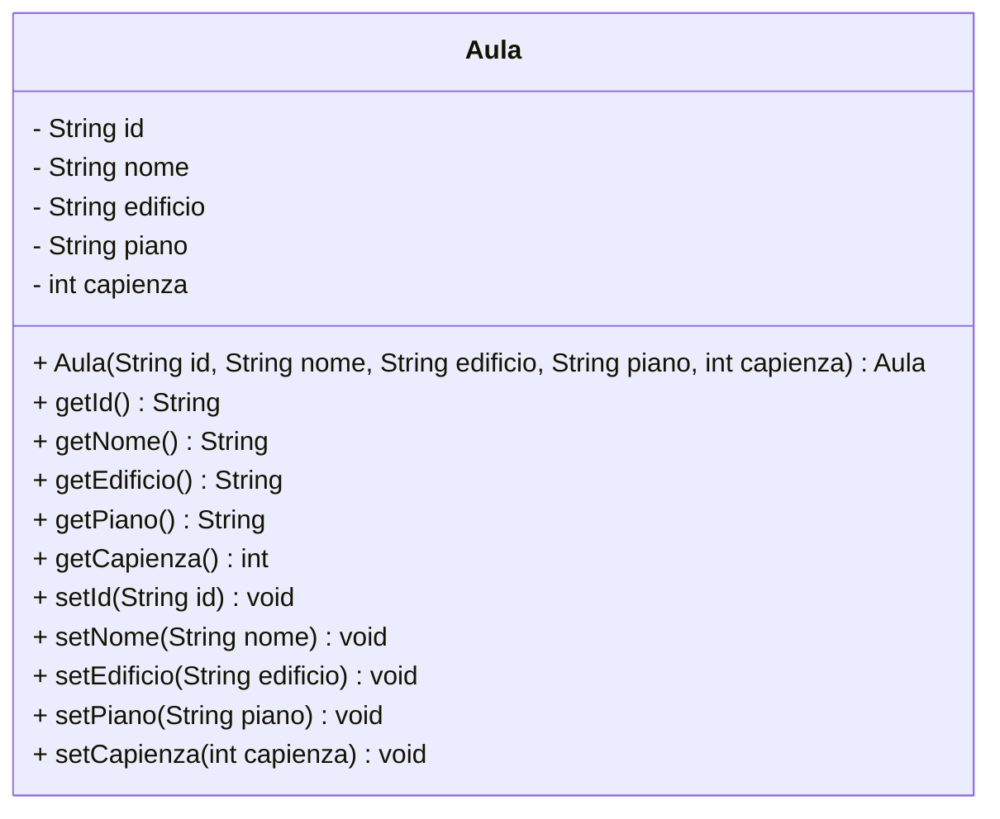

```mermaid
classDiagram
    class Aula{
        - String id
        %% codice identificativo univoco
        - String nome
        - String edificio
        - String piano
        - int capienza
        + Aula(String id, String nome, String edificio, String piano, int capienza) Aula
        + getId() String
        + getNome() String
        + getEdificio() String
        + getPiano() String
        + getCapienza() int
        + setId(String id) void
        + setNome(String nome) void
        + setEdificio(String edificio) void
        + setPiano(String piano) void
        + setCapienza(int capienza) void       
    }

```
