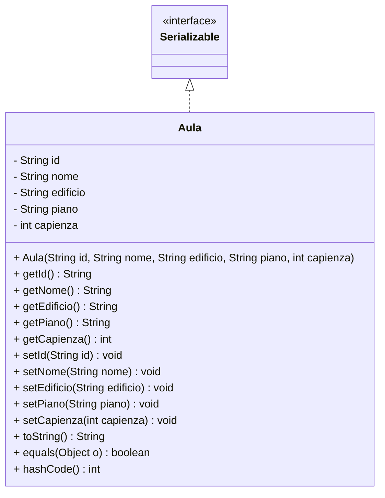

```mermaid
classDiagram

    class Serializable {
             <<interface>>
    }

    Serializable <|.. Aula

    class Aula{
        - String id
        %% codice identificativo univoco
        - String nome
        - String edificio
        - String piano
        - int capienza
        + Aula(String id, String nome, String edificio, String piano, int capienza) 
        + getId() String
        + getNome() String
        + getEdificio() String
        + getPiano() String
        + getCapienza() int
        + setId(String id) void
        + setNome(String nome) void
        + setEdificio(String edificio) void
        + setPiano(String piano) void
        + setCapienza(int capienza) void      
        + toString() String

        + equals(Object o) boolean
        + hashCode() int
    }

```
