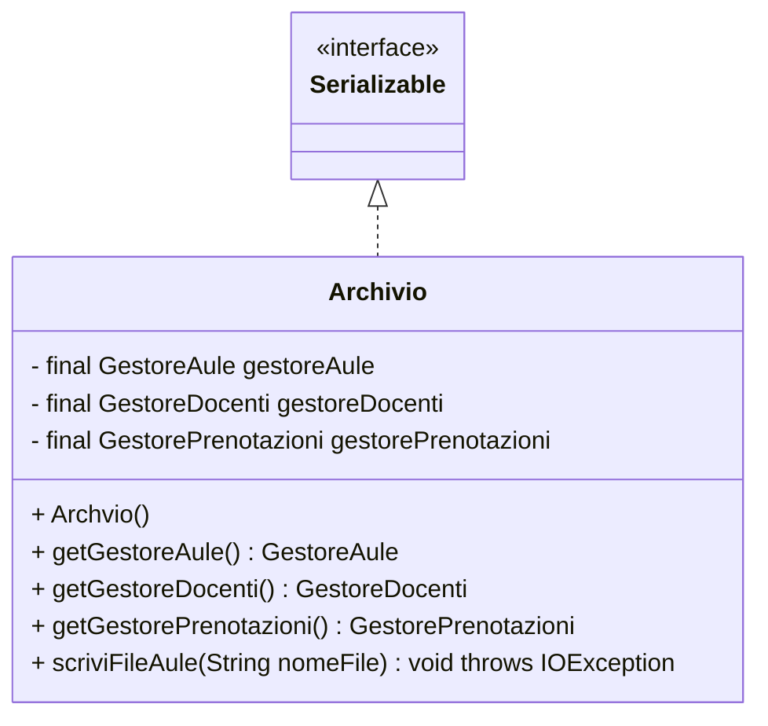

```mermaid
classDiagram

    class Serializable {
             <<interface>>
    }

    Serializable <|.. Archivio

    class Archivio{
    - final GestoreAule gestoreAule
    - final GestoreDocenti gestoreDocenti
    - final GestorePrenotazioni gestorePrenotazioni

    + Archvio()
    %% getter
    + getGestoreAule() GestoreAule
    + getGestoreDocenti() GestoreDocenti
    + getGestorePrenotazioni() GestorePrenotazioni

    + scriviFileAule(String nomeFile) void throws IOException
    }

```
