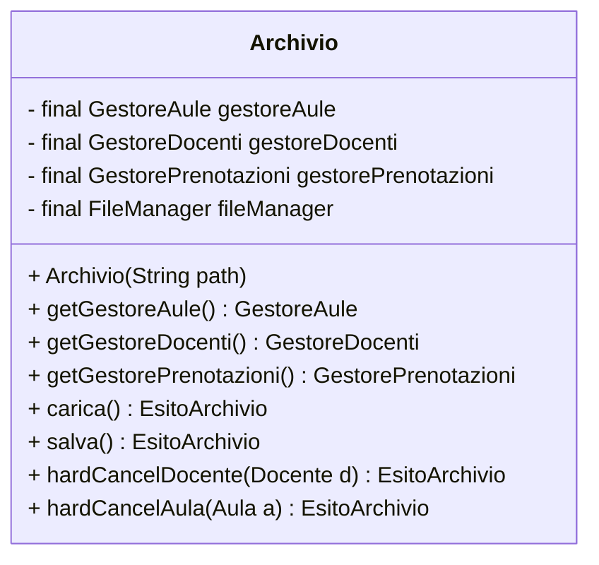

```mermaid
classDiagram

    class Archivio{
    - final GestoreAule gestoreAule
    - final GestoreDocenti gestoreDocenti
    - final GestorePrenotazioni gestorePrenotazioni
    - final FileManager fileManager
    
    %% path è il percorso del fileManager

    + Archivio(String path)
    
    %% getter
    + getGestoreAule() GestoreAule
    + getGestoreDocenti() GestoreDocenti
    + getGestorePrenotazioni() GestorePrenotazioni

    %% qui contatta il fileManager 

    + carica() EsitoArchivio
    + salva() EsitoArchivio

    %% hardCancelDocente chiama la rimozione docente di GestoreDocenti e la rimozione prenotazioni
    %% associate a docente di GestorePrenotazioni

    + hardCancelDocente(Docente d) EsitoArchivio

    %% hardCancelAula chiama la rimozione aula di GestoreAule e la rimozione prenotazioni
    %% associate a aula di GestorePrenotazioni

    + hardCancelAula(Aula a) EsitoArchivio

    %% wrapping di GestoreAule

    

    
    }

```
