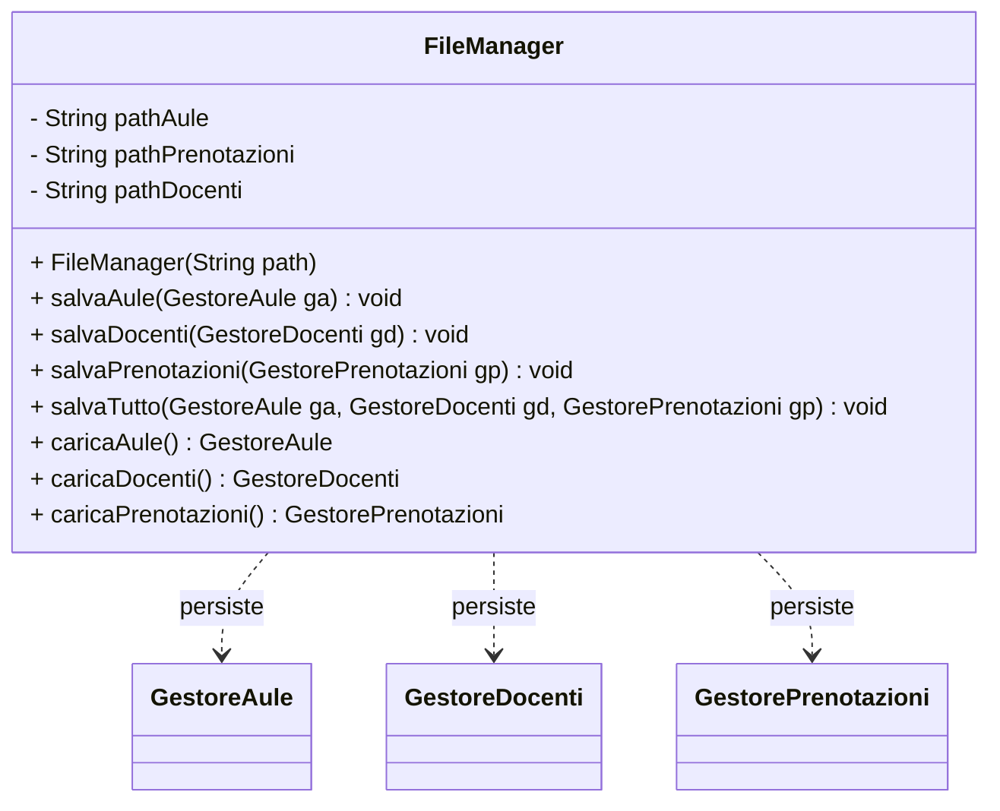

```mermaid

classDiagram

    class FileManager{
        
        %% attributi
        - String pathAule
        - String pathPrenotazioni
        - String pathDocenti

        + FileManager(String path)

        %% salvataggio
        + salvaAule(GestoreAule ga) void
        + salvaDocenti(GestoreDocenti gd) void
        + salvaPrenotazioni(GestorePrenotazioni gp) void

        + salvaTutto(GestoreAule ga, GestoreDocenti gd, GestorePrenotazioni gp) void

        %% caricamento
        + caricaAule() GestoreAule
        + caricaDocenti() GestoreDocenti
        + caricaPrenotazioni() GestorePrenotazioni


    }

    FileManager ..> GestoreAule : persiste
    FileManager ..> GestoreDocenti : persiste
    FileManager ..> GestorePrenotazioni : persiste

```
