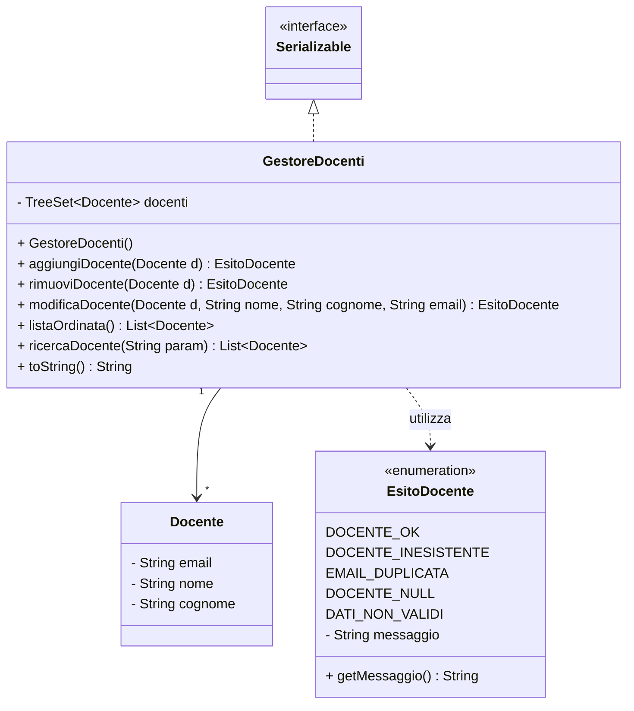

```mermaid
classDiagram
    class Serializable {
             <<interface>>
    }

    Serializable <|.. GestoreDocenti 

    class Docente{
        - String email
        %% univoca      
        - String nome
        - String cognome
    }

    class EsitoDocente{
        <<enumeration>>
        %%esito corretto
        DOCENTE_OK
        %%restituita se il docente passato non esiste
        DOCENTE_INESISTENTE
        %%restituita se la mail è già associata ad un altro docente
        EMAIL_DUPLICATA
        %%restituita se il docente passato è null
        DOCENTE_NULL
        DATI_NON_VALIDI
        
        - String messaggio
        + getMessaggio() String
    }

    class GestoreDocenti{
        - TreeSet~Docente~ docenti
        + GestoreDocenti()
        %%restituisce l'esito dell'operazione
        + aggiungiDocente(Docente d) EsitoDocente
        %%restituisce l'esito della prenotazione
        + rimuoviDocente (Docente d) EsitoDocente
        %%restituisce l'esito dell'operazione
        + modificaDocente (Docente d, String nome, String cognome, String email) EsitoDocente
        %%restituisce una lista ordinata contenente i docenti
        + listaOrdinata () List~Docente~
        %%restituisce una lista ordinata di docenti il cui cognome o la cui mail
        %%contiene la stringa passata 
        + ricercaDocente (String param) List~Docente~

        + toString() String
    }

    GestoreDocenti "1" --> "*" Docente
    GestoreDocenti ..> EsitoDocente : utilizza
```

