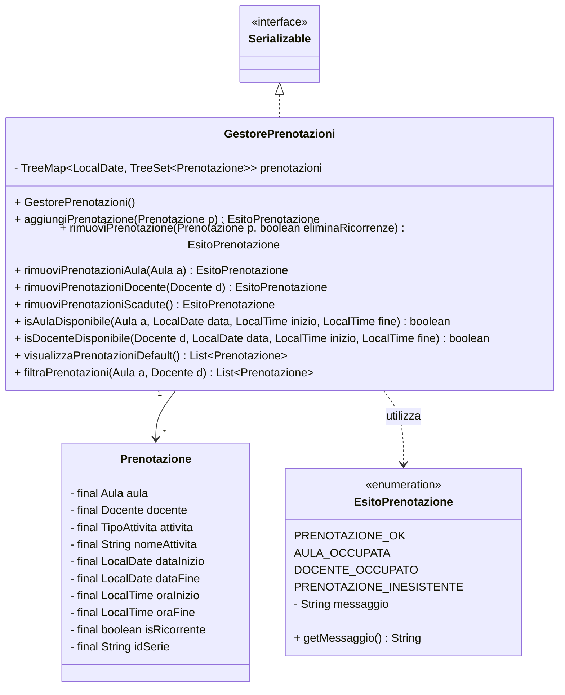

```mermaid
classDiagram

    class Serializable {
             <<interface>>
    }

    Serializable <|.. GestorePrenotazioni

    class Prenotazione{
        - final Aula aula
        - final Docente docente
        - final TipoAttivita attivita
        - final String nomeAttivita
        - final LocalDate dataInizio
        - final LocalDate dataFine
        - final LocalTime oraInizio
        - final LocalTime oraFine
        - final boolean isRicorrente
        - final String idSerie     
        %% codice interno x controlli nostri
    }

    class GestorePrenotazioni{
        - TreeMap~LocalDate, TreeSet&lt;Prenotazione&gt;~ prenotazioni
        
        %% costruttore
        + GestorePrenotazioni()
        
        %% aggiunta prenotazione
        + aggiungiPrenotazione(Prenotazione p) EsitoPrenotazione

        %% rimuovi prenotazione
        + rimuoviPrenotazione(Prenotazione p, boolean eliminaRicorrenze) EsitoPrenotazione

        %% rimuovi prenotazione per aula
        %% da utilizzare quando viene rimossa l'aula
        + rimuoviPrenotazioniAula(Aula a) EsitoPrenotazione

        %% rimuovi prenotazione per docente
        %% da utilizzare quando viene rimosso un docente
        + rimuoviPrenotazioniDocente(Docente d) EsitoPrenotazione

        %% rimuovi prenotazioni scadute (da chiamare all'avvio PS3)
        + rimuoviPrenotazioniScadute() EsitoPrenotazione

        %% controllo aula disponibile 
        + isAulaDisponibile(Aula a, LocalDate data, LocalTime inizio, LocalTime fine) boolean
        + isDocenteDisponibile(Docente d, LocalDate data, LocalTime inizio, LocalTime fine) boolean
        %% visualizzazione prenotazioni di default (ordinamento per data e ora)
        + visualizzaPrenotazioniDefault() List~Prenotazione~
        
        %% visualizzazione prenotazioni filtrate
        %% aula == null / docente != null --> filtra docente
        %% aula != null / docente == null --> filtra aula
        %% aula != null / docente != null --> filtra x entrambi
        %% aula == null / docente == null --> === visualizzaPrenotazioniDefault()
        + filtraPrenotazioni(Aula a, Docente d) List~Prenotazione~


    }

    class EsitoPrenotazione {
        <<enumeration>>
        
        %% esito corretto
        PRENOTAZIONE_OK
        
        %% aula occupata per l'occorrenza
        AULA_OCCUPATA

        %% docente occupato per l'occorrenza
        DOCENTE_OCCUPATO

        %% per rimuoviPrenotazione
        PRENOTAZIONE_INESISTENTE 

        %%attributo privato immutabile che memorizza il testo descrittivo dell'esito
        - String messaggio

        %%metodo pubblico per accedere al testo descrittivo dell'esito
        + getMessaggio() String
    } 

    GestorePrenotazioni "1" --> "*" Prenotazione
    GestorePrenotazioni ..> EsitoPrenotazione : utilizza
        
```