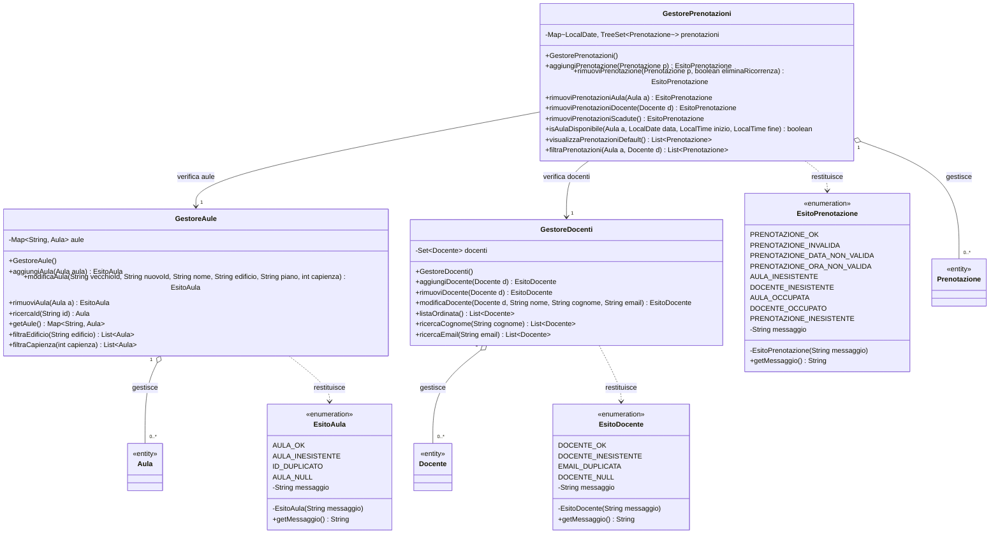

```mermaid
classDiagram
    direction TB

    %% --- Classi Gestori ---

    class GestoreAule {
        -Map~String, Aula~ aule
        +GestoreAule()
        +aggiungiAula(Aula aula) EsitoAula
        +modificaAula(String vecchioId, String nuovoId, String nome, String edificio, String piano, int capienza) EsitoAula
        +rimuoviAula(Aula a) EsitoAula
        +ricercaId(String id) Aula
        +getAule() Map~String, Aula~
        +filtraEdificio(String edificio) List~Aula~
        +filtraCapienza(int capienza) List~Aula~
    }

    class GestoreDocenti {
        -Set~Docente~ docenti
        +GestoreDocenti()
        +aggiungiDocente(Docente d) EsitoDocente
        +rimuoviDocente(Docente d) EsitoDocente
        +modificaDocente(Docente d, String nome, String cognome, String email) EsitoDocente
        +listaOrdinata() List~Docente~
        +ricercaCognome(String cognome) List~Docente~
        +ricercaEmail(String email) List~Docente~
    }

    class GestorePrenotazioni {
        -Map~LocalDate, TreeSet~Prenotazione~~ prenotazioni
        +GestorePrenotazioni()
        +aggiungiPrenotazione(Prenotazione p) EsitoPrenotazione
        +rimuoviPrenotazione(Prenotazione p, boolean eliminaRicorrenza) EsitoPrenotazione
        +rimuoviPrenotazioniAula(Aula a) EsitoPrenotazione
        +rimuoviPrenotazioniDocente(Docente d) EsitoPrenotazione
        +rimuoviPrenotazioniScadute() EsitoPrenotazione
        +isAulaDisponibile(Aula a, LocalDate data, LocalTime inizio, LocalTime fine) boolean
        +visualizzaPrenotazioniDefault() List~Prenotazione~
        +filtraPrenotazioni(Aula a, Docente d) List~Prenotazione~ 
    }

    %% --- Enum Esiti ---
    class EsitoAula {
        <<enumeration>>
        AULA_OK
        AULA_INESISTENTE
        ID_DUPLICATO
        AULA_NULL
        -String messaggio
        -EsitoAula(String messaggio)
        +getMessaggio() String
    }

    class EsitoDocente {
        <<enumeration>>
        DOCENTE_OK
        DOCENTE_INESISTENTE
        EMAIL_DUPLICATA
        DOCENTE_NULL
        -String messaggio
        -EsitoDocente(String messaggio)
        +getMessaggio() String
    }

    class EsitoPrenotazione {
        <<enumeration>>
        PRENOTAZIONE_OK
        PRENOTAZIONE_INVALIDA
        PRENOTAZIONE_DATA_NON_VALIDA
        PRENOTAZIONE_ORA_NON_VALIDA
        AULA_INESISTENTE
        DOCENTE_INESISTENTE
        AULA_OCCUPATA
        DOCENTE_OCCUPATO
        PRENOTAZIONE_INESISTENTE
        -String messaggio
        -EsitoPrenotazione(String messaggio)
        +getMessaggio() String
    }

    %% --- Riferimenti alle entità esterne (senza dettagli interni) ---
    class Aula {
        <<entity>>
    }
    class Docente {
        <<entity>>
    }
    class Prenotazione {
        <<entity>>
    }

    %% --- Relazioni ---
    GestoreAule "1" o-- "0..*" Aula : gestisce
    GestoreDocenti "1" o-- "0..*" Docente : gestisce
    GestorePrenotazioni "1" o-- "0..*" Prenotazione : gestisce

    GestorePrenotazioni --> "1" GestoreAule : verifica aule
    GestorePrenotazioni --> "1" GestoreDocenti : verifica docenti

    GestoreAule ..> EsitoAula : restituisce
    GestoreDocenti ..> EsitoDocente : restituisce
    GestorePrenotazioni ..> EsitoPrenotazione : restituisce
```
