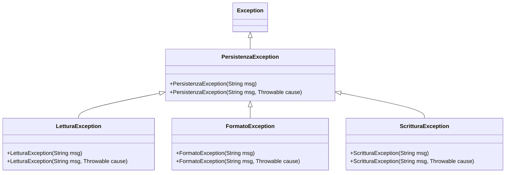

```mermaid
    classDiagram
    
    class Exception{

    }

    class PersistenzaException{
        +PersistenzaException(String msg)
        +PersistenzaException(String msg, Throwable cause)
    }

    Exception <|-- PersistenzaException

    class LetturaException{
        +LetturaException(String msg)
        +LetturaException(String msg, Throwable cause)
    }

    class FormatoException{
        +FormatoException(String msg)
        +FormatoException(String msg, Throwable cause)
    }

    class ScritturaException{
        +ScritturaException(String msg)
        +ScritturaException(String msg, Throwable cause)
    }

    PersistenzaException <|-- LetturaException
    PersistenzaException <|-- FormatoException
    PersistenzaException <|-- ScritturaException
```

