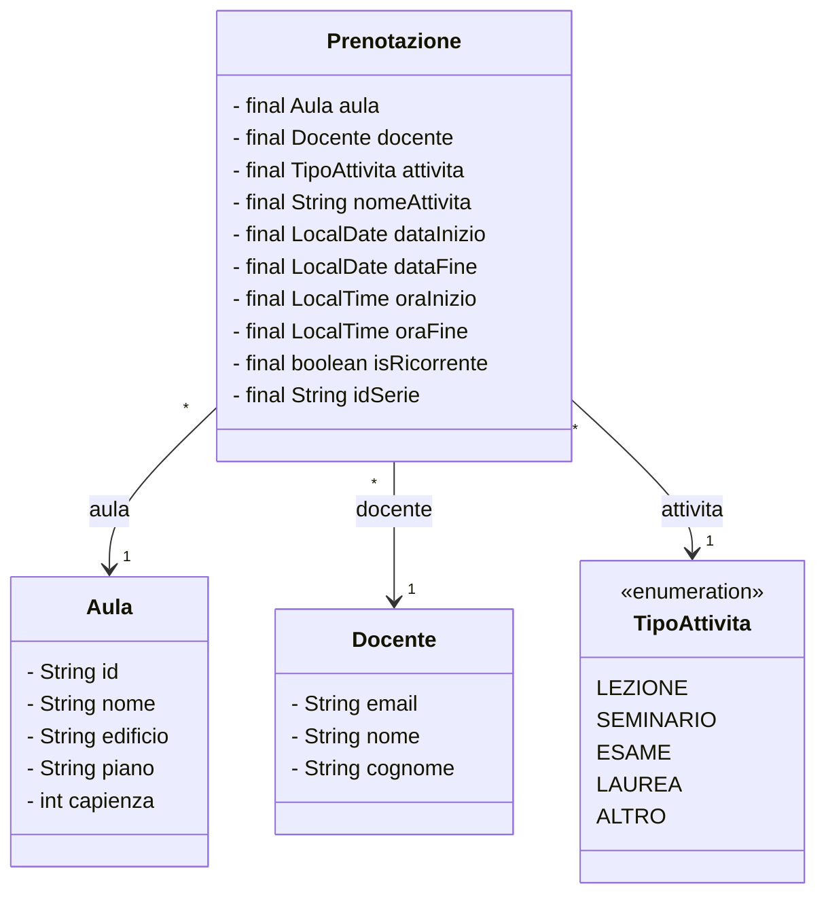

```mermaid
classDiagram
    class Aula{
        - String id
        %% codice identificativo univoco
        - String nome
        - String edificio
        - String piano
        - int capienza

       
    }

    class Docente{
        - String email
        %% univoca      
        - String nome
        - String cognome

        
    }

    class Prenotazione{
        - final Aula aula
        - final Docente docente
        - final TipoAttivita attivita
        - final String nomeAttivita
        - final LocalDate dataInizio
        - final LocalDate dataFine
        - final LocalTime oraInizio
        - final LocalTime oraFine
        - final boolean isRicorrente
        - final String idSerie        
        %% codice interno x controlli nostri
        
    }

    class TipoAttivita{
        <<enumeration>>
        LEZIONE
        SEMINARIO
        ESAME
        LAUREA
        ALTRO
    }


    

    Prenotazione "*" --> "1" Aula : aula            
    %% ogni singola Prenotazione è associata a esattamente 1 aula e 1 docente responsabile.
    Prenotazione "*" --> "1" Docente : docente       
    %% una stessa Aula (o Docente) può essere associata a zero o più prenotazioni nell'archivio.
    Prenotazione "*" --> "1" TipoAttivita : attivita

```
