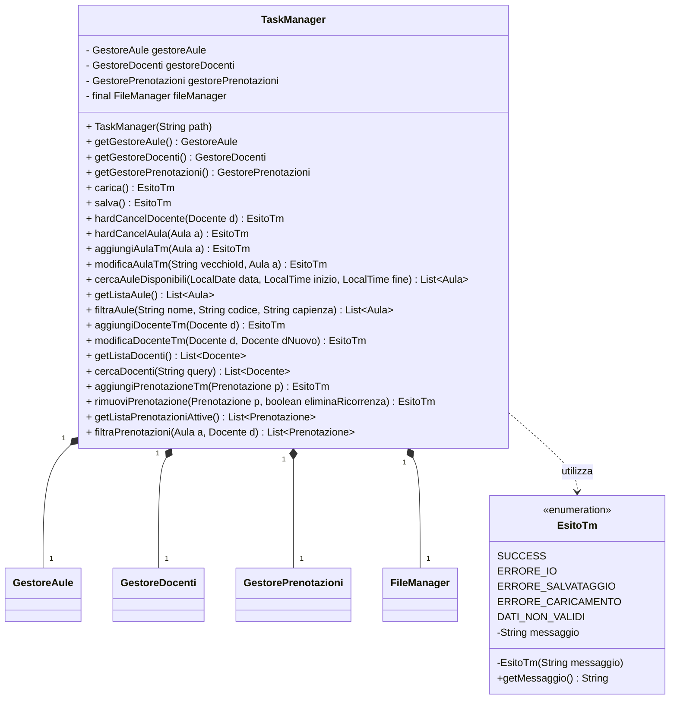

```mermaid
classDiagram

    class EsitoTm{
        <<enumeration>>
        SUCCESS
        ERRORE_IO
        ERRORE_SALVATAGGIO
        ERRORE_CARICAMENTO
        DATI_NON_VALIDI
        -String messaggio
        -EsitoTm(String messaggio)
        +getMessaggio() String
    }

    class TaskManager{
    - GestoreAule gestoreAule
    - GestoreDocenti gestoreDocenti
    - GestorePrenotazioni gestorePrenotazioni
    - final FileManager fileManager
    
    %% path è il percorso del fileManager

    + TaskManager(String path)
    
    %% getter
    + getGestoreAule() GestoreAule
    + getGestoreDocenti() GestoreDocenti
    + getGestorePrenotazioni() GestorePrenotazioni

    %% qui contatta il fileManager 

    + carica() EsitoTm
    + salva() EsitoTm

    %% hardCancelDocente chiama la rimozione docente di GestoreDocenti e la rimozione prenotazioni
    %% associate a docente di GestorePrenotazioni

    + hardCancelDocente(Docente d) EsitoTm

    %% hardCancelAula chiama la rimozione aula di GestoreAule e la rimozione prenotazioni
    %% associate a aula di GestorePrenotazioni

    + hardCancelAula(Aula a) EsitoTm

    %% wrapping di GestoreAule

    + aggiungiAulaTm(Aula a) EsitoTm
    + modificaAulaTm(String vecchioId, Aula a) EsitoTm

    + cercaAuleDisponibili(LocalDate data, LocalTime inizio, LocalTime fine) List~Aula~
    + getListaAule() List~Aula~
    + filtraAule(String nome, String codice, String capienza) List~Aula~

    %% wrapping di GestoreDocenti

    + aggiungiDocenteTm(Docente d) EsitoTm
    + modificaDocenteTm(Docente d, Docente dNuovo) EsitoTm

    + getListaDocenti() List~Docente~
    + cercaDocenti(String query) List~Docente~
    
    %% wrapping di GestorePrenotazioni

    + aggiungiPrenotazioneTm(Prenotazione p) EsitoTm
    + rimuoviPrenotazione(Prenotazione p, boolean eliminaRicorrenza) EsitoTm
    + getListaPrenotazioniAttive() List~Prenotazione~
    + filtraPrenotazioni(Aula a, Docente d) List~Prenotazione~
    
    }

    TaskManager "1" *-- "1" GestoreAule
    TaskManager "1" *-- "1" GestoreDocenti
    TaskManager "1" *-- "1" GestorePrenotazioni
    TaskManager "1" *-- "1" FileManager
    TaskManager ..> EsitoTm : utilizza

```
