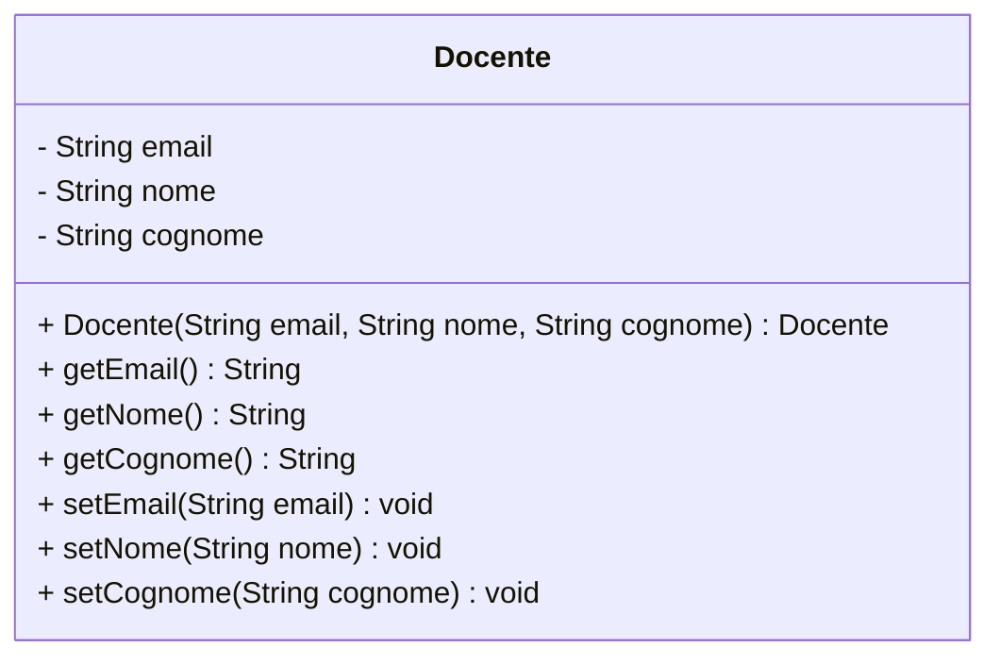

```mermaid
classDiagram
    class Docente{
        - String email
        %% univoca      
        - String nome
        - String cognome
        + Docente(String email, String nome, String cognome) Docente
        + getEmail() String
        + getNome() String
        + getCognome() String
        + setEmail(String email) void
        + setNome(String nome) void
        + setCognome(String cognome) void        
    }
```
