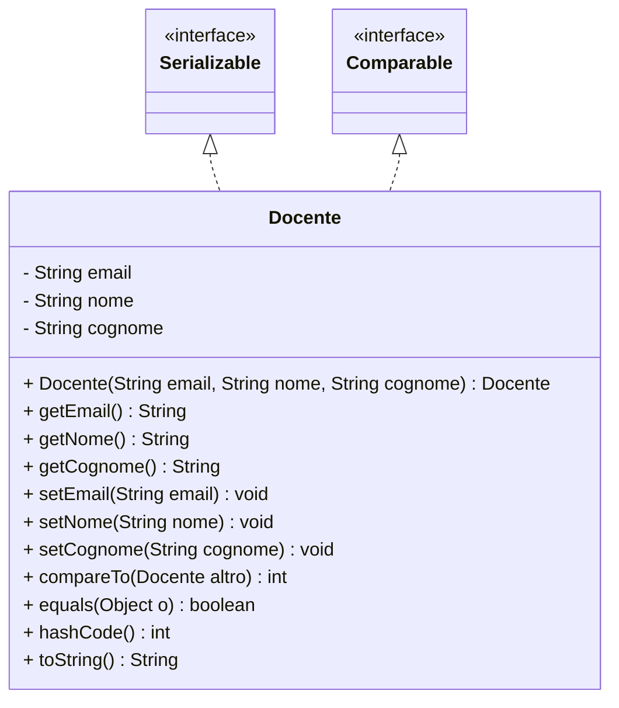

```mermaid
classDiagram

    class Serializable {
              <<interface>>
    }
    class Comparable {
              <<interface>>
    }

    Serializable <|.. Docente
    Comparable <|.. Docente

    class Docente{
        - String email
        %% univoca      
        - String nome
        - String cognome
        + Docente(String email, String nome, String cognome) Docente
        + getEmail() String
        + getNome() String
        + getCognome() String
        + setEmail(String email) void
        + setNome(String nome) void
        + setCognome(String cognome) void       

        + compareTo(Docente altro) int
        + equals(Object o) boolean
        + hashCode() int
        + toString() String
    }
```
