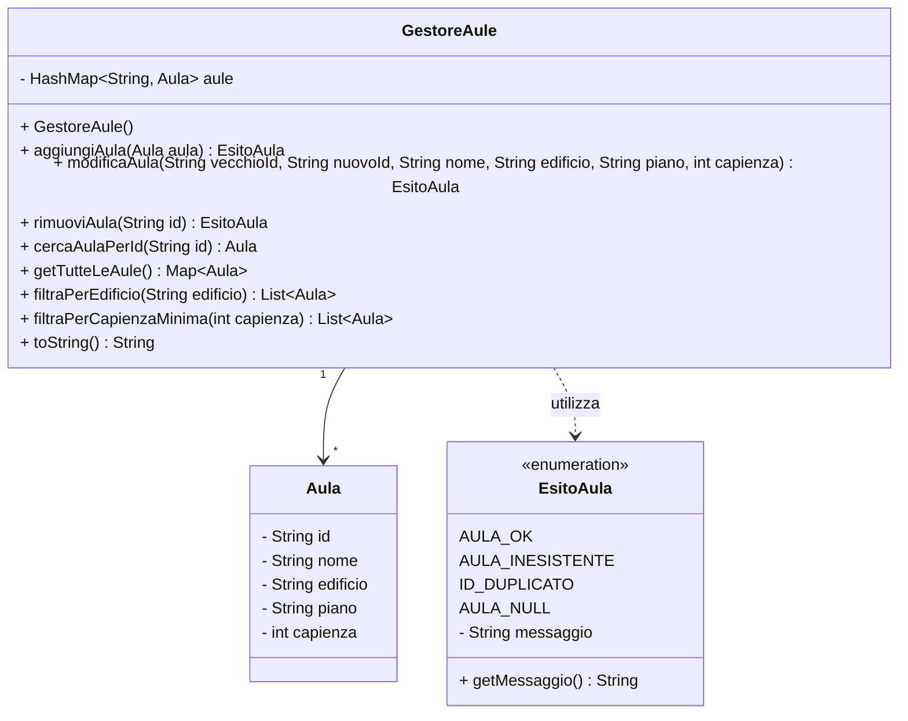

```mermaid
classDiagram


    class Aula {
        - String id
        %% codice identificativo univoco
        - String nome
        - String edificio
        - String piano
        - int capienza
    }

    class GestoreAule{
        - HashMap~String, Aula~ aule
        %% costruttore
        + GestoreAule()
        %% aggiunge un'aula verificando l'unicità dell'id e i valori nulli
        + aggiungiAula(Aula aula) EsitoAula
        %% modifica un'aula esistente gestendo anche l'eventuale cambio di ID
        + modificaAula(String vecchioId, String nuovoId, String nome, String edificio, String piano, int capienza) EsitoAula
        %% rimuove un'aula tramite il suo id
        + rimuoviAula(String id) EsitoAula
        %% cerca e restituisce un'aula tramite il suo id
        + cercaAulaPerId(String id) Aula
        %% restituisce una collezione di tutte le aule registrate
        + getTutteLeAule() Map~Aula~
        %% restituisce una lista di aule filtrate per edificio
        + filtraPerEdificio(String edificio) List~Aula~
        %% restituisce una lista di aule filtrate per capienza minima
        + filtraPerCapienzaMinima(int capienza) List~Aula~

        + toString() String
    }

    class EsitoAula {
        <<enumeration>>
        %%esito corretto
        AULA_OK
        %%restituita se l'aula passata non esiste
        AULA_INESISTENTE
        %%restituita se l'id è già associato ad un'altra aula
        ID_DUPLICATO
        %%restituita se l'aula passata è null
        AULA_NULL
        %%attributo privato immutabile che memorizza il testo descrittivo dell'esito
        - String messaggio
        %%metodo pubblico per accedere al testo descrittivo dell'esito
        + getMessaggio() String
    }
    GestoreAule "1" --> "*" Aula
    GestoreAule ..> EsitoAula : utilizza
        
```
