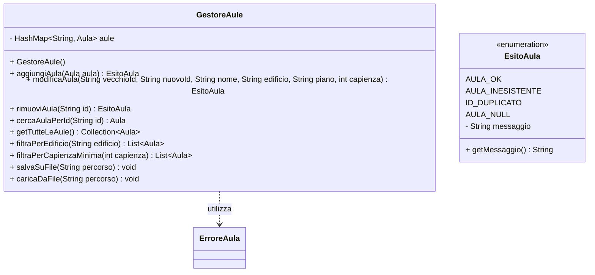

```mermaid
classDiagram
    class GestoreAule{
        - HashMap~String, Aula~ aule
        + GestoreAule()
        + aggiungiAula(Aula aula) EsitoAula
        + modificaAula(String vecchioId, String nuovoId, String nome, String edificio, String piano, int capienza) EsitoAula
        + rimuoviAula(String id) EsitoAula
        + cercaAulaPerId(String id) Aula
        + getTutteLeAule() Collection~Aula~
        + filtraPerEdificio(String edificio) List~Aula~
        + filtraPerCapienzaMinima(int capienza) List~Aula~
        + salvaSuFile(String percorso) void
        + caricaDaFile(String percorso) void
    }

    class EsitoAula {
        <<enumeration>>
        %%esito corretto
        AULA_OK
        %%restituita se l'aula passata non esiste
        AULA_INESISTENTE
        %%restituita se l'id è già associato ad un'altra aula
        ID_DUPLICATO
        %%restituita se l'aula passata è null
        AULA_NULL
        %%attributo privato immutabile che memorizza il testo descrittivo dell'esito
        - String messaggio
        %%metodo pubblico per accedere al testo descrittivo dell'esito
        + getMessaggio() String
    }
    GestoreAule ..> ErroreAula : utilizza
        
```
