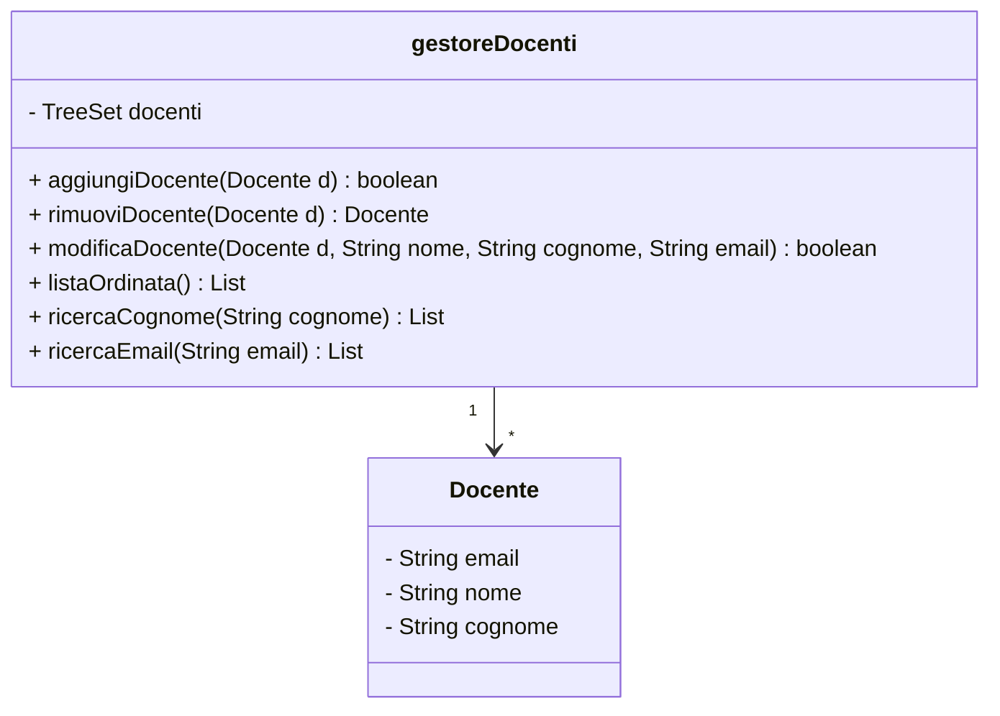

```mermaid
classDiagram
    class Docente{
        - String email
        %% univoca      
        - String nome
        - String cognome
    }

    class gestoreDocenti{
        - TreeSet<Docente> docenti
        %%restituisce un booleano con l'esito dell'operazione
        + aggiungiDocente(Docente d) boolean
        %%restituisce l'oggetto rimosso
        + rimuoviDocente (Docente d) Docente
        %%modifica docente
        + modificaDocente (Docente d, String nome, String cognome, String email) boolean
        %%restituisce una lista ordinata contenente i docenti
        + listaOrdinata () List<Docente>
        %%restituisce una lista ordinata di docenti il cui cognome 
        %%contiene la stringa passata
        + ricercaCognome (String cognome) List<Docente>
        %%restituisce una lista ordinata di docenti la cui mail 
        %%contiene la stringa passata
        + ricercaEmail (String email) List<Docente>
    }

    gestoreDocenti "1" --> "*" Docente
```

