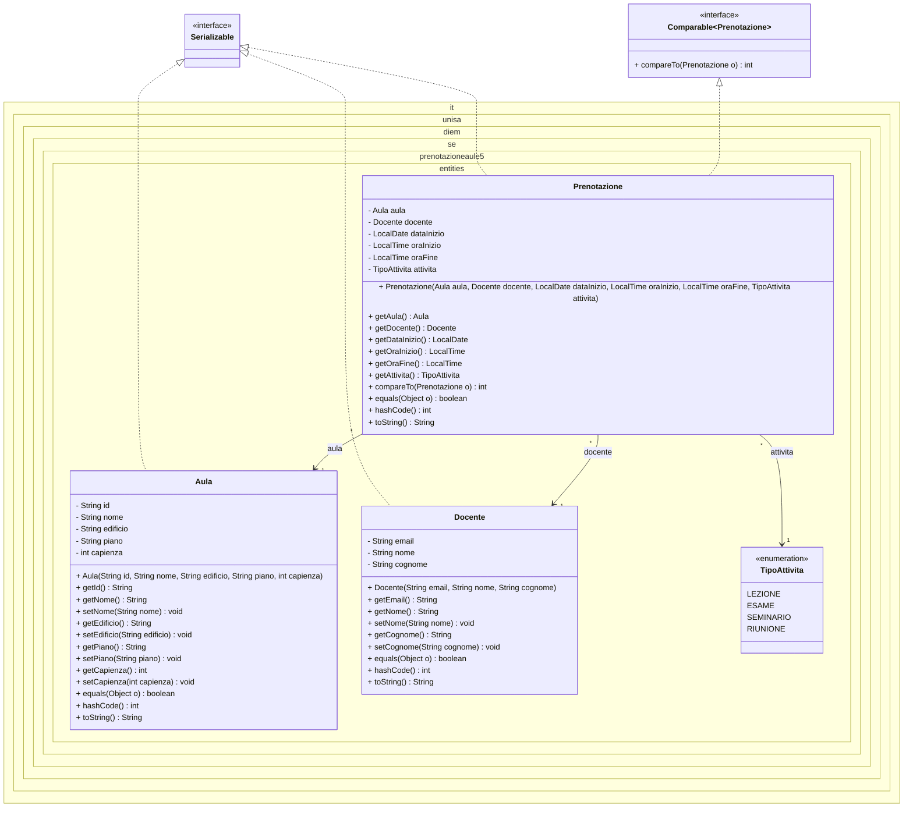

```mermaid
classDiagram
    direction TB

    namespace it.unisa.diem.se.prenotazioneaule5.entities {
        class Aula {
            - String id
            - String nome
            - String edificio
            - String piano
            - int capienza
            + Aula(String id, String nome, String edificio, String piano, int capienza)
            + getId() String
            + getNome() String
            + setNome(String nome) void
            + getEdificio() String
            + setEdificio(String edificio) void
            + getPiano() String
            + setPiano(String piano) void
            + getCapienza() int
            + setCapienza(int capienza) void
            + equals(Object o) boolean
            + hashCode() int
            + toString() String
        }

        class Docente {
            - String email
            - String nome
            - String cognome
            + Docente(String email, String nome, String cognome)
            + getEmail() String
            + getNome() String
            + setNome(String nome) void
            + getCognome() String
            + setCognome(String cognome) void
            + equals(Object o) boolean
            + hashCode() int
            + toString() String
        }

        class Prenotazione {
            - Aula aula
            - Docente docente
            - LocalDate dataInizio
            - LocalTime oraInizio
            - LocalTime oraFine
            - TipoAttivita attivita
            + Prenotazione(Aula aula, Docente docente, LocalDate dataInizio, LocalTime oraInizio, LocalTime oraFine, TipoAttivita attivita)
            + getAula() Aula
            + getDocente() Docente
            + getDataInizio() LocalDate
            + getOraInizio() LocalTime
            + getOraFine() LocalTime
            + getAttivita() TipoAttivita
            + compareTo(Prenotazione o) int
            + equals(Object o) boolean
            + hashCode() int
            + toString() String
        }

        class TipoAttivita {
            <<enumeration>>
            LEZIONE
            ESAME
            SEMINARIO
            RIUNIONE
        }
    }

    class Serializable {
        <<interface>>
    }
    class Comparable~Prenotazione~ {
        <<interface>>
        + compareTo(Prenotazione o) int
    }

    Serializable <|.. Aula
    Serializable <|.. Docente
    Serializable <|.. Prenotazione
    Comparable <|.. Prenotazione

    Prenotazione "*" --> "1" Aula : aula
    Prenotazione "*" --> "1" Docente : docente
    Prenotazione "*" --> "1" TipoAttivita : attivita

```
