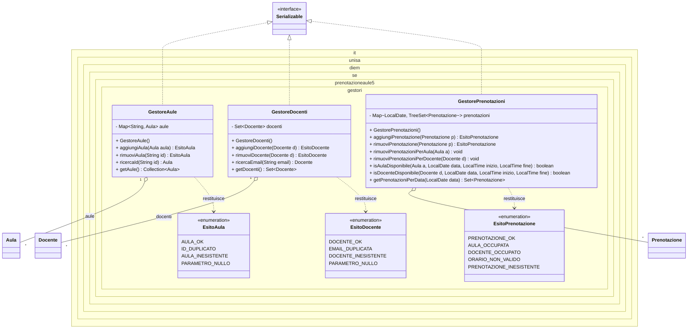

```mermaid
classDiagram
    direction TB

    namespace it.unisa.diem.se.prenotazioneaule5.gestori {
        class GestoreAule {
            - Map~String, Aula~ aule
            + GestoreAule()
            + aggiungiAula(Aula aula) EsitoAula
            + rimuoviAula(String id) EsitoAula
            + ricercaId(String id) Aula
            + getAule() Collection~Aula~
        }

        class GestoreDocenti {
            - Set~Docente~ docenti
            + GestoreDocenti()
            + aggiungiDocente(Docente d) EsitoDocente
            + rimuoviDocente(Docente d) EsitoDocente
            + ricercaEmail(String email) Docente
            + getDocenti() Set~Docente~
        }

        class GestorePrenotazioni {
            - Map~LocalDate, TreeSet~Prenotazione~~ prenotazioni
            + GestorePrenotazioni()
            + aggiungiPrenotazione(Prenotazione p) EsitoPrenotazione
            + rimuoviPrenotazione(Prenotazione p) EsitoPrenotazione
            + rimuoviPrenotazioniPerAula(Aula a) void
            + rimuoviPrenotazioniPerDocente(Docente d) void
            + isAulaDisponibile(Aula a, LocalDate data, LocalTime inizio, LocalTime fine) boolean
            + isDocenteDisponibile(Docente d, LocalDate data, LocalTime inizio, LocalTime fine) boolean
            + getPrenotazioniPerData(LocalDate data) Set~Prenotazione~
        }

        class EsitoAula {
            <<enumeration>>
            AULA_OK
            ID_DUPLICATO
            AULA_INESISTENTE
            PARAMETRO_NULLO
        }

        class EsitoDocente {
            <<enumeration>>
            DOCENTE_OK
            EMAIL_DUPLICATA
            DOCENTE_INESISTENTE
            PARAMETRO_NULLO
        }

        class EsitoPrenotazione {
            <<enumeration>>
            PRENOTAZIONE_OK
            AULA_OCCUPATA
            DOCENTE_OCCUPATO
            ORARIO_NON_VALIDO
            PRENOTAZIONE_INESISTENTE
        }
    }

    class Serializable {
        <<interface>>
    }

    Serializable <|.. GestoreAule
    Serializable <|.. GestoreDocenti
    Serializable <|.. GestorePrenotazioni

    GestoreAule "1" o-- "*" Aula : aule
    GestoreDocenti "1" o-- "*" Docente : docenti
    GestorePrenotazioni "1" o-- "*" Prenotazione : prenotazioni

    GestoreAule ..> EsitoAula : restituisce
    GestoreDocenti ..> EsitoDocente : restituisce
    GestorePrenotazioni ..> EsitoPrenotazione : restituisce

```

