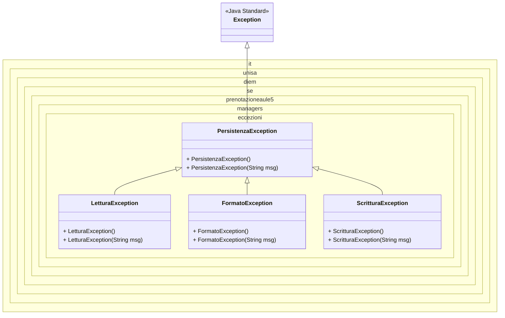

```mermaid
classDiagram
    direction TB

    namespace it.unisa.diem.se.prenotazioneaule5.managers.eccezioni {
        class PersistenzaException {
            + PersistenzaException()
            + PersistenzaException(String msg)
        }

        class LetturaException {
            + LetturaException()
            + LetturaException(String msg)
        }

        class FormatoException {
            + FormatoException()
            + FormatoException(String msg)
        }

        class ScritturaException {
            + ScritturaException()
            + ScritturaException(String msg)
        }
    }

    class Exception {
        <<Java Standard>>
    }

    Exception <|-- PersistenzaException
    PersistenzaException <|-- LetturaException
    PersistenzaException <|-- FormatoException
    PersistenzaException <|-- ScritturaException
```