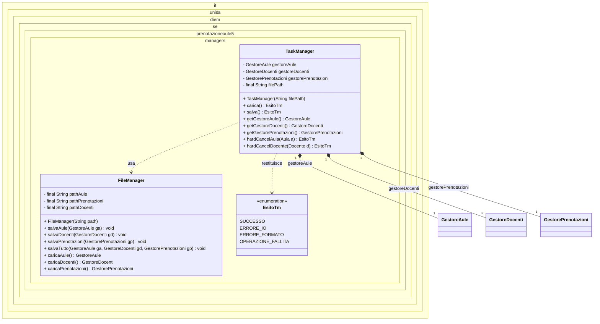

```mermaid
classDiagram
    direction TB

    namespace it.unisa.diem.se.prenotazioneaule5.managers {
        class TaskManager {
            -  GestoreAule gestoreAule
            -  GestoreDocenti gestoreDocenti
            -  GestorePrenotazioni gestorePrenotazioni
            - final String filePath
            + TaskManager(String filePath)
            + carica() EsitoTm
            + salva() EsitoTm
            + getGestoreAule() GestoreAule
            + getGestoreDocenti() GestoreDocenti
            + getGestorePrenotazioni() GestorePrenotazioni
            + hardCancelAula(Aula a) EsitoTm
            + hardCancelDocente(Docente d) EsitoTm
        }

        class FileManager {
            - final String pathAule
            - final String pathPrenotazioni
            - final String pathDocenti
            + FileManager(String path)
            + salvaAule(GestoreAule ga) void
            + salvaDocenti(GestoreDocenti gd) void
            + salvaPrenotazioni(GestorePrenotazioni gp) void
            + salvaTutto(GestoreAule ga, GestoreDocenti gd, GestorePrenotazioni gp) void
            + caricaAule() GestoreAule
            + caricaDocenti() GestoreDocenti
            + caricaPrenotazioni() GestorePrenotazioni
        }

        class EsitoTm {
            <<enumeration>>
            SUCCESSO
            ERRORE_IO
            ERRORE_FORMATO
            OPERAZIONE_FALLITA
        }
    }

    TaskManager "1" *-- "1" GestoreAule : gestoreAule
    TaskManager "1" *-- "1" GestoreDocenti : gestoreDocenti
    TaskManager "1" *-- "1" GestorePrenotazioni : gestorePrenotazioni

    TaskManager ..> FileManager : usa
    TaskManager ..> EsitoTm : restituisce

```
