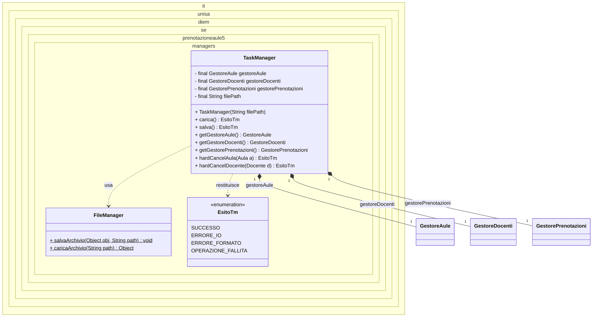

```mermaid
classDiagram
    direction TB

    namespace it.unisa.diem.se.prenotazioneaule5.managers {
        class TaskManager {
            - final GestoreAule gestoreAule
            - final GestoreDocenti gestoreDocenti
            - final GestorePrenotazioni gestorePrenotazioni
            - final String filePath
            + TaskManager(String filePath)
            + carica() EsitoTm
            + salva() EsitoTm
            + getGestoreAule() GestoreAule
            + getGestoreDocenti() GestoreDocenti
            + getGestorePrenotazioni() GestorePrenotazioni
            + hardCancelAula(Aula a) EsitoTm
            + hardCancelDocente(Docente d) EsitoTm
        }

        class FileManager {
            + salvaArchivio(Object obj, String path)$ void
            + caricaArchivio(String path)$ Object
        }

        class EsitoTm {
            <<enumeration>>
            SUCCESSO
            ERRORE_IO
            ERRORE_FORMATO
            OPERAZIONE_FALLITA
        }
    }

    TaskManager "1" *-- "1" GestoreAule : gestoreAule
    TaskManager "1" *-- "1" GestoreDocenti : gestoreDocenti
    TaskManager "1" *-- "1" GestorePrenotazioni : gestorePrenotazioni

    TaskManager ..> FileManager : usa
    TaskManager ..> EsitoTm : restituisce

```
