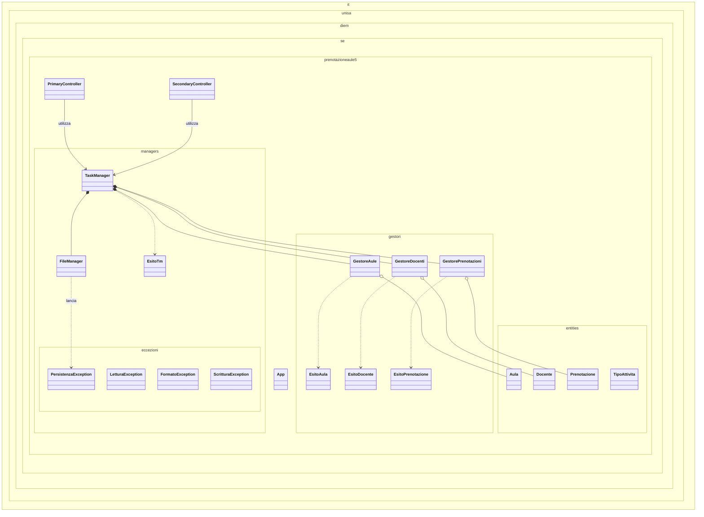

```mermaid
classDiagram

    namespace it.unisa.diem.se.prenotazioneaule5 {
        %%%%DA MODIFICARE IN BASE A SCELTE GUI
        class App
        class PrimaryController
        class SecondaryController
    }

    namespace it.unisa.diem.se.prenotazioneaule5.managers {
        class TaskManager
        class FileManager
        class EsitoTm
    }

     namespace it.unisa.diem.se.prenotazioneaule5.managers.eccezioni {
        class PersistenzaException
        class LetturaException
        class FormatoException
        class ScritturaException
    }

    namespace it.unisa.diem.se.prenotazioneaule5.gestori {
        class GestoreAule
        class GestoreDocenti
        class GestorePrenotazioni
        class EsitoAula
        class EsitoDocente
        class EsitoPrenotazione
    }

    namespace it.unisa.diem.se.prenotazioneaule5.entities {
        class Aula
        class Docente
        class Prenotazione
        class TipoAttivita
    }

    %%%%relazioni e dipendenze tra i package

    %%%%%%%% DA MODIFICARE IN BASE A SCELTE GUI 
    PrimaryController --> TaskManager : utilizza
    SecondaryController --> TaskManager : utilizza

    TaskManager *-- GestoreAule
    TaskManager *-- GestoreDocenti
    TaskManager *-- GestorePrenotazioni
    TaskManager *-- FileManager

    %%%%file manager può lanciare Persistenza Exception (formato, scrittura, lettura exception)
    FileManager ..> PersistenzaException : lancia

    %%%%ogni gestore contiene la collezione della propria entità (aggregazione)
    GestoreAule o-- Aula
    GestoreDocenti o-- Docente
    GestorePrenotazioni o-- Prenotazione

    %%%%dipendenza d'uso: l'esito è creato e restituito, non posseduto.
    GestoreAule ..> EsitoAula
    GestoreDocenti ..> EsitoDocente
    GestorePrenotazioni ..> EsitoPrenotazione
    TaskManager ..> EsitoTm

```
