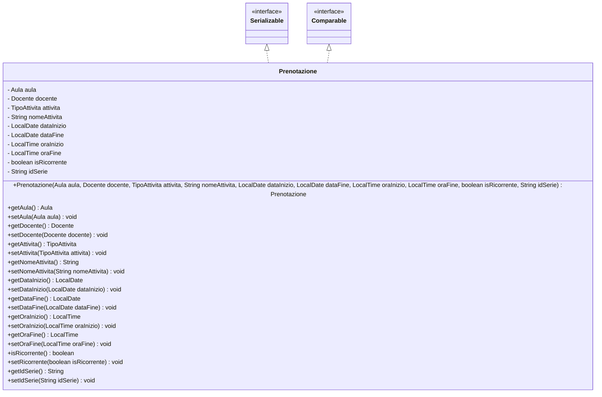

```mermaid
classDiagram

    class Serializable {
             <<interface>>
    }
    class Comparable {
             <<interface>>
    }

    Serializable <|.. Prenotazione
    Comparable <|.. Prenotazione


 class Prenotazione{
        - Aula aula
        - Docente docente
        - TipoAttivita attivita
        - String nomeAttivita
        - LocalDate dataInizio
        - LocalDate dataFine
        - LocalTime oraInizio
        - LocalTime oraFine
        - boolean isRicorrente
        - String idSerie        
        %% codice interno x controlli nostri
        
        %%Costruttore 
        +Prenotazione(Aula aula, Docente docente, TipoAttivita attivita, String nomeAttivita, LocalDate dataInizio, LocalDate dataFine, LocalTime oraInizio, LocalTime oraFine, boolean isRicorrente, String idSerie) Prenotazione
        +getAula() Aula
        +setAula(Aula aula) void
        +getDocente() Docente
        +setDocente(Docente docente) void
        +getAttivita() TipoAttivita
        +setAttivita(TipoAttivita attivita) void
        +getNomeAttivita() String
        +setNomeAttivita(String nomeAttivita) void
        +getDataInizio() LocalDate
        +setDataInizio(LocalDate dataInizio) void
        +getDataFine() LocalDate
        +setDataFine(LocalDate dataFine) void
        +getOraInizio() LocalTime
        +setOraInizio(LocalTime oraInizio) void
        +getOraFine() LocalTime
        +setOraFine(LocalTime oraFine) void
        +isRicorrente() boolean
        +setRicorrente(boolean isRicorrente) void
        +getIdSerie() String
        +setIdSerie(String idSerie) void

        

    }
```