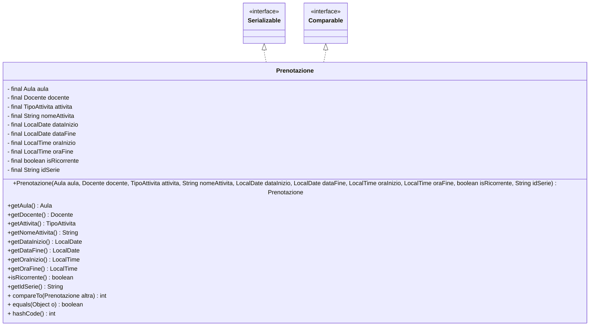

```mermaid
classDiagram

    class Serializable {
             <<interface>>
    }
    class Comparable {
             <<interface>>
    }

    Serializable <|.. Prenotazione
    Comparable <|.. Prenotazione


 class Prenotazione{
        - final Aula aula
        - final Docente docente
        - final TipoAttivita attivita
        - final String nomeAttivita
        - final LocalDate dataInizio
        - final LocalDate dataFine
        - final LocalTime oraInizio
        - final LocalTime oraFine
        - final boolean isRicorrente
        - final String idSerie 
        %% codice interno x controlli nostri
        
        %%Costruttore 
        +Prenotazione(Aula aula, Docente docente, TipoAttivita attivita, String nomeAttivita, LocalDate dataInizio, LocalDate dataFine, LocalTime oraInizio, LocalTime oraFine, boolean isRicorrente, String idSerie) Prenotazione
        +getAula() Aula
        +getDocente() Docente
        +getAttivita() TipoAttivita
        +getNomeAttivita() String
        +getDataInizio() LocalDate
        +getDataFine() LocalDate
        +getOraInizio() LocalTime
        +getOraFine() LocalTime
        +isRicorrente() boolean
        +getIdSerie() String


        + compareTo(Prenotazione altra) int
        + equals(Object o) boolean
        + hashCode() int

        

    }
```